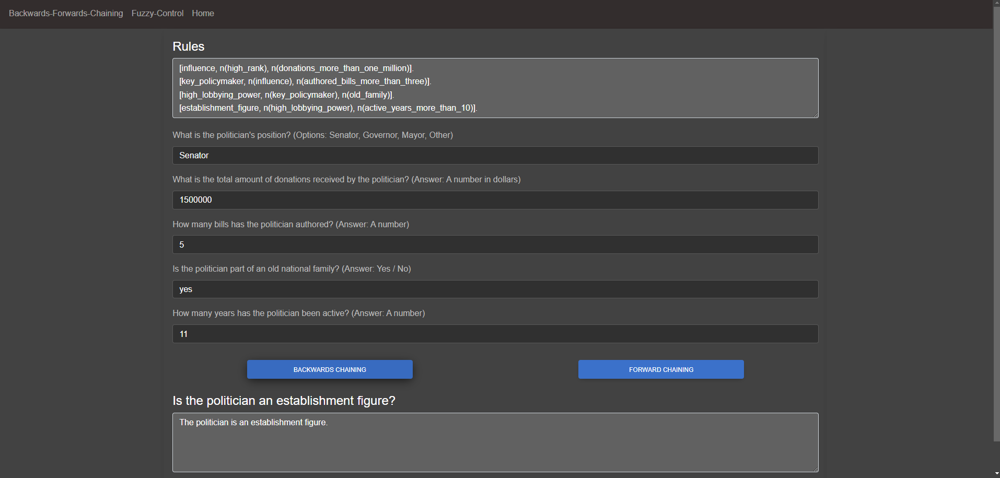
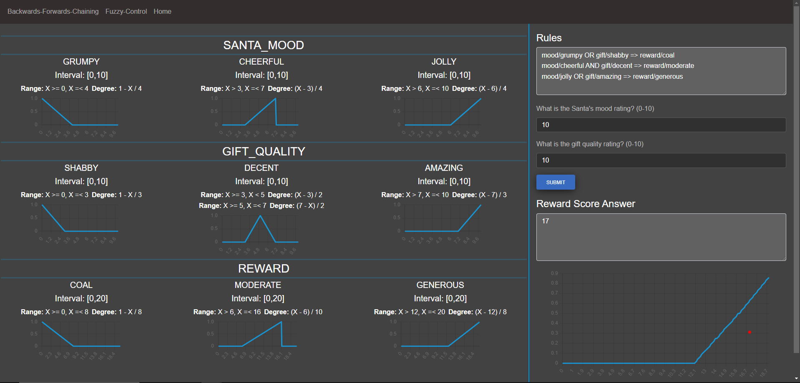

# Backwards_Forwards_Prop-Fuzzy_Control-KRR

## Description
This is a project for **Knowledge Reason & Representation** course in *Artificial Intelligence Master* course of FMI Unibuc. It's supposed to 
cover 2 topics:
- Backwards & Forwards Chaining (2 inference methods on SLDs)
- Fuzzy-Control (measuring vagueness for different predicates)
For more information, the documentation is attached to the rest of the files.

## The stack:
- React for Frontend GUI
- ExpressJS for intermediary server (needed for exposure for Frontend and access to common txt files)
- Prolog for backend server (this is where the logic resides)

## Installation
1. Above the list of files, click <>Code.
2. Copy the desired URL for the repository (HTTPS, SSH), or use Github CLI.
3. Open Git Bash on your machine.
4. Change the current working directory to the location where you want the cloned directory:
    ```bash
        cd <workdir_name>
    ```
5. Type git clone, and then paste the URL you copied earlier:
    ```bash
        git clone <copied_URL>
    ```
6. Install the dependencies and run the React app:
    ```bash
        cd ./graphical_interface

        npm i 

        npm run dev
    ```
7. Install the dependencies and run the ExpressJS server:
    ```bash
        cd ./prolog/server

        npm i 

        node server.js
    ```
8. Run the Prolog server:
    ```bash
        cd ./prolog

        swipl -q -f server.pl -g "server(3002)."
    ```

## Visuals

### Backwards-Forwards Chaining Page


### Fuzzy Control Page


## Final Note
Not much to show in terms of visuals of GUI. Majority of the work was don in the backend side.
Prolog is nice, but let's use another declarative language, please.

## License
This project is licensed under the MIT License. See the LICENSE file for details.

## Contact
Feel free to contact me at: karjhan1999@gmail.com